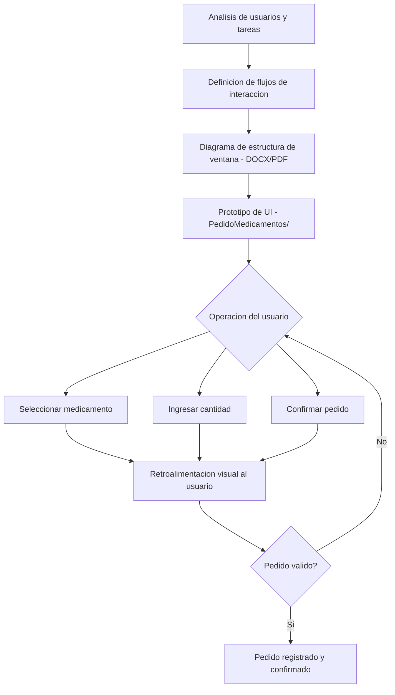

# Diseño e Implementación de Interfaz de Usuario — PedidoMedicamentos

> Diseño e implementación de interfaz gráfica de usuario para un sistema de pedido de medicamentos.

## Descripción

---

Proyecto de diseño e implementación de GUI para el módulo **PedidoMedicamentos** de un sistema de salud. Se aplican principios de **HCI (Human-Computer Interaction)**: análisis de usuarios, definición de flujos de interacción, diseño de estructura de ventanas, prototipado y desarrollo de la interfaz funcional.

## Contenido del repositorio

| Archivo/Carpeta | Descripción |
|---|---|
| `PedidoMedicamentos/` | Código fuente de la aplicación |
| `Diagrama De Estructura De La Ventana*.docx/pdf` | Diagrama estructural de la UI |
| `Diseño E Implementación*.pdf` | Informe completo del diseño |
| `Desarrollo De Proyecto*.pdf` | Documentación del proyecto |

## Principios de diseño aplicados

- Análisis de tareas y definición de flujos de usuario
- Diseño de estructura de ventanas (Window Structure Diagram)
- Consistencia visual y uso de patrones de interfaz estándar
- Retroalimentación visual al usuario en cada operación

## Contexto académico

**Asignatura:** Interacción Persona-Ordenador · **Institución:** Ingeniería Informática
**Autor:** Alejandro De Mendoza — Ingeniero Informático · Especialista Ingeniería de Software

---

## Arquitectura

## Autor

**Alejandro De Mendoza**  
Ingeniero Informático · Especialista en IA · Especialista en Ingeniería de Software · Máster en Arquitectura de Software

